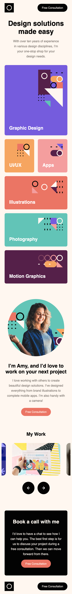
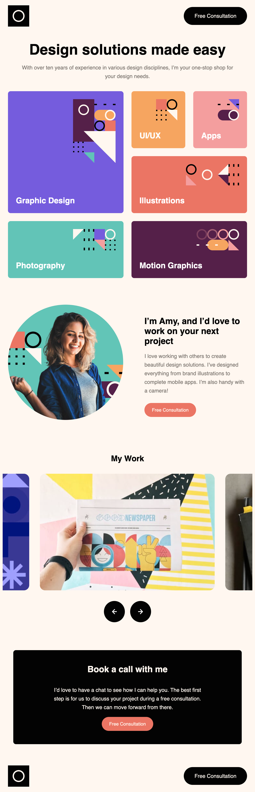
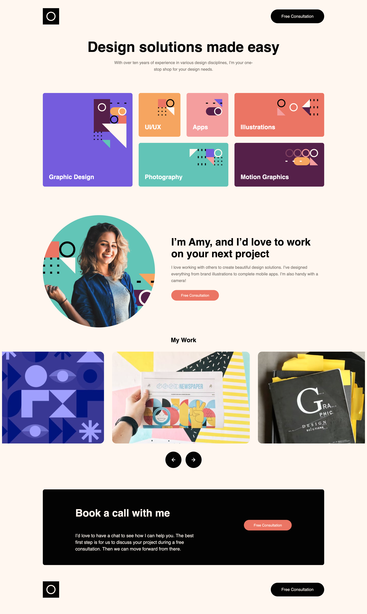

# Frontend Mentor - Single-page design portfolio solution

This is a solution to the [Single-page design portfolio challenge on Frontend Mentor](https://www.frontendmentor.io/challenges/singlepage-design-portfolio-2MMhyhfKVo). Frontend Mentor challenges help you improve your coding skills by building realistic projects.

## Table of contents

- [Overview](#overview)
  - [The challenge](#the-challenge)
  - [Screenshot](#screenshot)
  - [Links](#links)
- [My process](#my-process)
  - [Built with](#built-with)
  - [What I learned](#what-i-learned)
  - [Continued development](#continued-development)
  - [Useful resources](#useful-resources)
- [Author](#author)

## Overview

### The challenge

Users should be able to:

- View the optimal layout for the site depending on their device's screen size
- See hover states for all interactive elements on the page
- Navigate the slider using either their mouse/trackpad or keyboard

### Screenshot

### Links

- Solution URL: [Add solution URL here](https://your-solution-url.com)
- Live Site URL: [https://github.com/cwwittor/singlepage-design-portfolio](https://github.com/cwwittor/singlepage-design-portfolio)

## My process

### Built with

- Semantic HTML5 markup
- CSS custom properties
- Flexbox
- CSS Grid
- Mobile-first workflow
- Javascript

**Note: These are just examples. Delete this note and replace the list above with your own choices**

### What I learned

This project was a bit harder than the first few I had done, I think what I learned from this was how to import and use javascript in a barebones project, and that a lot of my solutions right now arent great due to only working at the assigned viewports. I need to get better at not making brittle designs.

### Continued development

- move away from brittle resizing.
- had gotten a little lazy with css variables.

### Useful resources

stack overflow, w3 schools. and for small reference stuff raycast

## Author

- Frontend Mentor - [@cwwittor](https://www.frontendmentor.io/profile/cwwittor)
